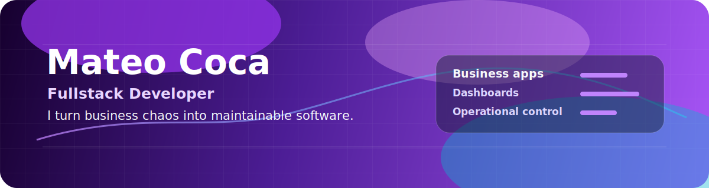

---

## What I Build

I build the kind of internal software companies start needing when spreadsheets, manual control and scattered information stop being enough.

My strongest focus is turning messy business workflows into clear systems: cash control, treasury operations, dashboards, user roles, reporting and process automation.

I do not only code screens. I map the operation, protect the business rules, document the decisions and leave the system easier to maintain.

## Why Teams Hire Me

| I bring | What that means for the company |
|---|---|
| Business-first thinking | I care about the workflow, not only the ticket. The software has to match how people actually work. |
| Fullstack execution | I can move from database model to backend rules to usable screens without losing context. |
| Operational control | I understand cash, treasury, roles, reports, validations and audit trails as product requirements. |
| Maintainable delivery | I write with structure, tests and documentation so the next change is cheaper, not harder. |

## Tech Stack

## Featured Work

| Project | What it shows | Stack |
|---|---|---|
| [Gerayse](https://github.com/Froaky/gerayse1.0) | Operational cash and treasury management system for branch-based businesses. Includes cash boxes, shifts, movements, closings, role-based screens and business dashboards. | Django, PostgreSQL, HTMX |
| [Customer Churn ML](https://github.com/Froaky/customer-churn-ml) | Machine Learning project for customer retention decisions. Includes EDA, preprocessing, model comparison and business-oriented metric interpretation. | Python, pandas, scikit-learn |
| [Portfolio](https://github.com/Froaky/portfolio) | Personal developer portfolio built as a frontend project. | Next.js, TypeScript, CSS |

## Current Focus

| Area | What I can help with |
|---|---|
| Business web apps | Internal systems, admin panels, CRUD workflows, dashboards and role-based access |
| Backend | Django apps, PostgreSQL data models, service-layer business rules and tests |
| Frontend | Clean interfaces with Next.js, TypeScript, HTML, CSS and responsive layouts |
| Data projects | Python analysis, ML pipelines, model evaluation and business-oriented conclusions |

## Contact

I am open to fullstack developer roles, freelance projects and business software opportunities where reliability, clarity and execution matter.

- Email: [mateococa.job@gmail.com](mailto:mateococa.job@gmail.com)
- GitHub: [github.com/Froaky](https://github.com/Froaky)
- Location: Salta, Argentina
